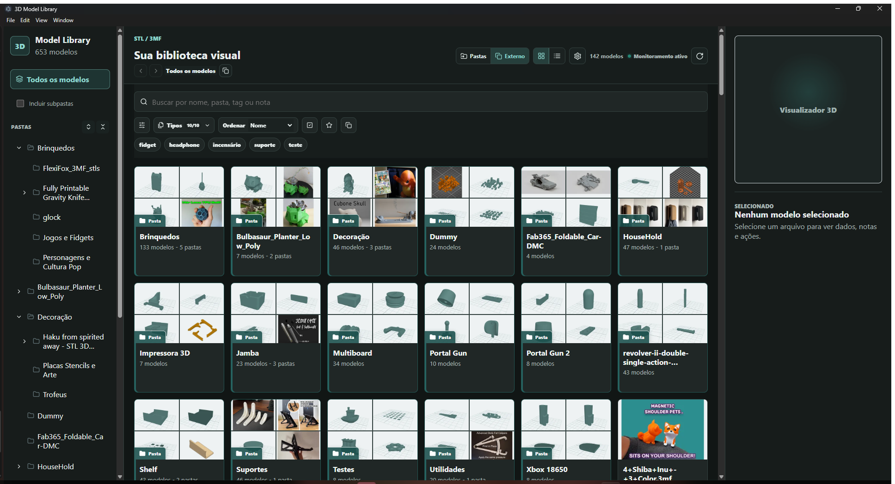
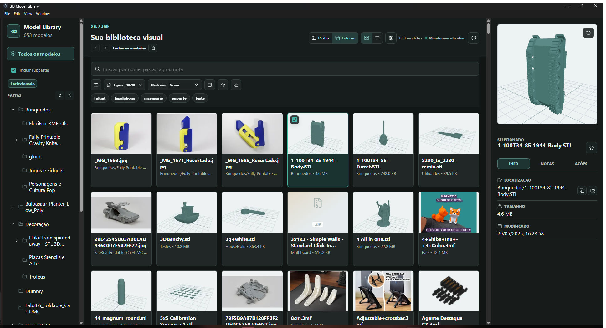

# 3D Model Library

[English](README.md) | [Português (Brasil)](README.pt-BR.md)

Um aplicativo desktop local para Windows, criado para navegar, visualizar e organizar grandes bibliotecas de impressão 3D sem mover os arquivos para um banco de dados proprietário.



## Por Que Ele Existe

Coleções grandes de STL e 3MF ficam difíceis de reconhecer no Explorador de Arquivos. O 3D Model Library adiciona prévias visuais, navegação rápida, tags, notas, ferramentas para arquivos compactados e integração com slicers, mantendo a estrutura original de pastas como fonte de verdade.

## Principais Recursos

- Visualização em grade ou lista para árvores grandes de pastas.
- Miniaturas em cache e prévias interativas de STL, 3MF e OBJ somente com geometria.
- Mosaicos de pasta criados a partir dos modelos armazenados dentro dela.
- Busca, ordenação, favoritos, notas, tags reutilizáveis e filtros combináveis.
- Mover e renomear arquivos ou pastas, com exclusões enviadas para a Lixeira do Windows.
- Arraste nativo para o Explorador, Cura, Creality Print e aplicativos desktop compatíveis.
- Detecção automática de slicers FDM populares e configuração de executáveis personalizados.
- Inspeção e extração de ZIP, RAR e 7Z.
- Conversão de 3MF para STL sem bloquear a interface.
- Interface em português do Brasil e inglês, temas claro e escuro e layout desktop responsivo.
- Metadados portáteis por biblioteca para backup e migração.



## Formatos Compatíveis

| Formato | Miniatura / prévia | Ação padrão |
| --- | --- | --- |
| STL, 3MF | Miniatura 3D gerada e prévia interativa | Abrir no slicer configurado |
| OBJ | Miniatura e prévia limitada somente à geometria | Carregar no aplicativo |
| PNG, JPG, JPEG, WebP | Miniatura da imagem original | Abrir no visualizador padrão do Windows |
| ZIP, RAR, 7Z | Identificação e inspeção do conteúdo | Inspecionar ou extrair |

Materiais OBJ, texturas externas, pontos e linhas são ignorados intencionalmente. A inspeção de RAR e 7Z requer um extrator compatível, como o 7-Zip.

## Dados Locais

O aplicativo não exige conta, serviço em nuvem ou telemetria. Os modelos permanecem onde estão, a menos que você escolha mover, renomear, extrair, converter ou enviar um item para a Lixeira.

Cada biblioteca guarda seus dados permanentes de organização em:

```text
.3d-model-library\3D_LIBRARY_DATA_DO_NOT_DELETE.json
```

Esse arquivo contém caminhos relativos, tags, notas, favoritos e histórico de slicers. O catálogo reconstruível fica separado em `LIBRARY_INDEX_DO_NOT_DELETE.json`. Inclua a pasta oculta `.3d-model-library` ao fazer backup da biblioteca.

A recuperação de renomeações externas usa uma identidade SHA-256 calculada em fluxo somente para arquivos que possuem dados salvos. A associação só é restaurada quando o resultado é único; duplicatas ambíguas são apresentadas para revisão em vez de serem adivinhadas.

Consulte [Backup e recuperação](docs/maintenance/library-data-recovery.md) para o procedimento completo.

## Estado do Desenvolvimento

O projeto está em desenvolvimento ativo e ainda não possui instalador assinado nem versão empacotada. Por enquanto, execute o aplicativo pelo código-fonte.

### Requisitos

- Windows 10 ou mais recente.
- Node.js 22.12 ou mais recente.
- Cura, Creality Print ou outro slicer FDM é opcional.
- 7-Zip ou um extrator compatível é opcional para arquivos RAR e 7Z.

### Executar Localmente

No Windows, a forma mais simples é abrir `setup-windows.cmd` com dois cliques. Ele verifica o Node.js, instala exatamente as dependências travadas no projeto e cria um atalho na Área de Trabalho. O script não pede acesso de administrador nem baixa nada fora do npm.

Depois da preparação, use o atalho da Área de Trabalho ou abra `start-3d-model-library.cmd` com dois cliques.

Para preparar manualmente:

```powershell
npm ci
npm run electron:dev
```

### Verificar Alterações

```powershell
npm test
npm run build
npm audit --omit=dev
```

### Benchmark de Miniaturas

O benchmark usa um perfil descartável e não grava na biblioteca escolhida:

```powershell
npm run build
npm run benchmark:thumbnails -- --library "C:\Modelos" --scenario cold
npm run benchmark:thumbnails -- --library "C:\Modelos" --scenario warm
npm run benchmark:thumbnails -- --library "C:\Modelos" --scenario scroll
```

Os relatórios guardam somente contagens e tempos agregados. Eles não contêm nomes de modelos, arquivos ou caminhos da biblioteca. Consulte a [linha de base do benchmark](docs/performance/thumbnail-benchmark-baseline.md).

## Segurança

- Operações de arquivo são validadas contra a biblioteca ativa.
- O arraste externo copia os arquivos para o destino; não remove os originais.
- Caminhos fora da biblioteca ativa e sessões antigas são rejeitados.
- Saídas geradas, estado local do aplicativo, benchmarks, segredos e artefatos nativos são ignorados pelo Git.
- Não envie bibliotecas de modelos, executáveis de slicers, chaves de API, tokens, arquivos `.env` ou caminhos pessoais para o repositório.

Para relatar vulnerabilidades e consultar a política de dependências, leia [SECURITY.md](SECURITY.md).

